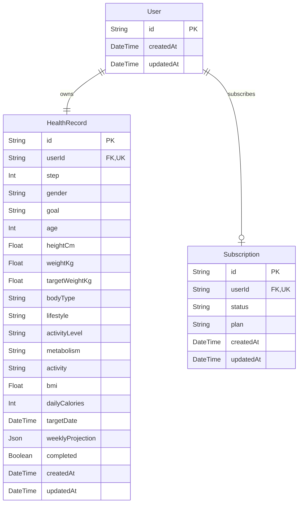

# WellPath Database Schema

`HealthRecord.userId` and `Subscription.userId` are unique foreign keys. Deleting a user cascades to both related records. A user owns exactly one active health record in the application model and may have zero or one subscription.
